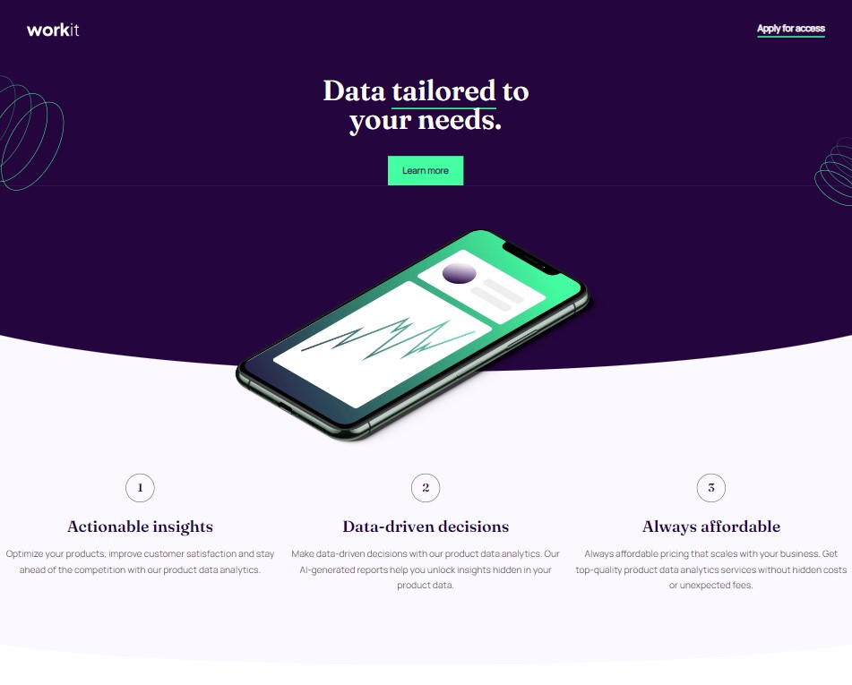

Workit landing page solution

## Table of contents

- [Overview](#overview)
  - [The challenge](#the-challenge)
  - [Screenshot](#screenshot)
  - [Links](#links)
- [My process](#my-process)
  - [Built with](#built-with)
- [Author](#author)

## Overview

### The challenge

Users should be able to:

- View the optimal layout for the interface depending on their device's screen size
- See hover and focus states for all interactive elements on the page

### Screenshot

### Links

- [Solution](https://github.com/juhnovais/workit-landing-page )
- [Live site](https://juhnovais.github.io/workit-landing-page )

## My process

### Built with

- Semantic HTML5 markup
- CSS custom properties
- Flexbox
- CSS Grid
- Sass
- Mobile-first workflow
- [Bootstrap](https://getbootstrap.com/)
- JavaScript

## Author

- Website - [juhnovais](https://github.com/juhnovais)
- Frontend Mentor - [@juhnovais](https://www.frontendmentor.io/profile/juhnovais)

